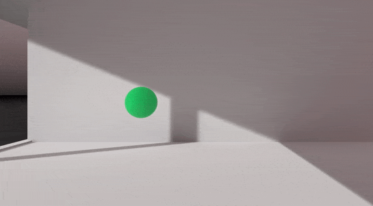

# Black Hole Storage

Black Hole Storage is a virtual, spatial storage solution which extends Ultraleap's [Interaction Engine](https://github.com/ultraleap/UnityPlugin). Think of Black Hole Storage as virtual pocket spaces, which shrink space when closed, and expand space when open.

## Dependencies

- Ultraleap's [Interaction Engine](https://github.com/ultraleap/UnityPlugin) (included in the package manager via openupm).
- Joaen's [EasyIK](https://github.com/joaen/EasyIK) (included in the repo).

## Interaction Concepts

Black Hole Storage introduces two concepts built off of the interaction engine:

### 1. Tappable InteractionBehaviours

Tappable interaction behaviours act exactly like normal Interaction Behaviours, in that you are able to grasp and move them about, but you are also able to tap them. This behaviour is inspired by [Leap Motion Paint](https://www.youtube.com/watch?v=UqNq0T0Le9c), which was built before the interaction engine, and which
had tappable, graspable objects.

Due to being able to robustly distinguish between a grab and a tap, we can only trigger taps on contact end, not start.

### 2. Black Hole Storage

Black Hole Storage (referred to as `Storage`) in the codebase, are spatial pockets which store objects, and allow you to spatially position stored objects in a radius around them. Black Hole Storages can contain other Black Hole Storages, allowing for nested spatial maps.

As storages are essentially fancy interaction behaviours, they are compatible with other systems in the interaction engine, such as anchors.

Building off storage are `TendrilStorage` - a storage iteration which use [EasyIK](https://github.com/joaen/EasyIK)'s FABRIK solution as a way of conveying the storage's radius - once a FABRIK chain becomes straight, and begins to shrink, a user knows that they are nearing the edge of the radius. These are intended both as a drag and drop solution for storage, and an example of how to style and extend off the base `Storage.cs` class.

## Getting Started

We include two prefabs - `Storage - Unstyled` and `Storage - Tendril`. Storage unstyled is purely a functional, base storage object. It uses `Storage.cs`, which is a good class to build off of to extend and style your own storage solutions.

`Storage - Tendril` is built off of `Storage.cs`, using `TendrilStorage.cs`. It uses FABRIK Chains as "tendrils" which elegantly provide storage radius information to a user.
